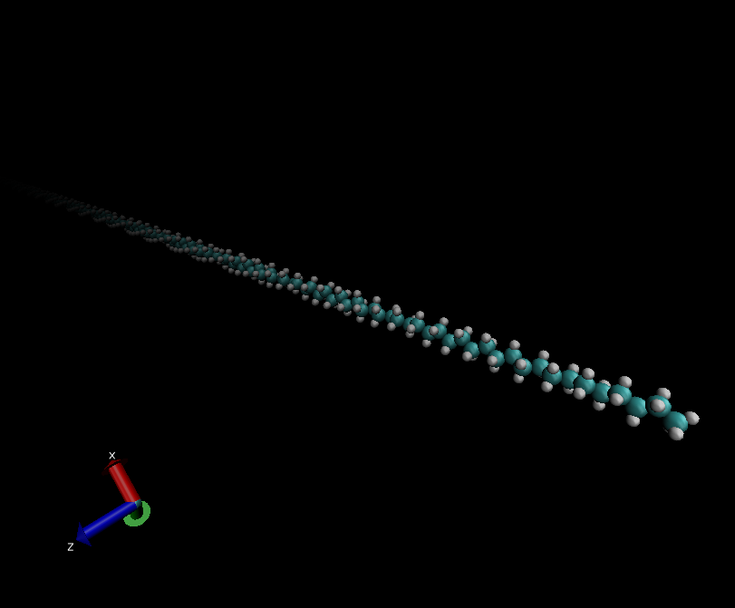
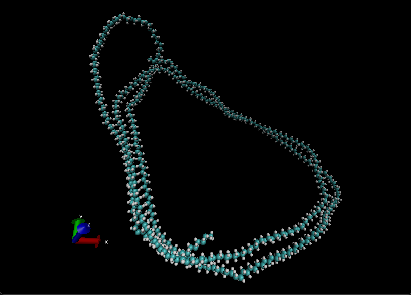
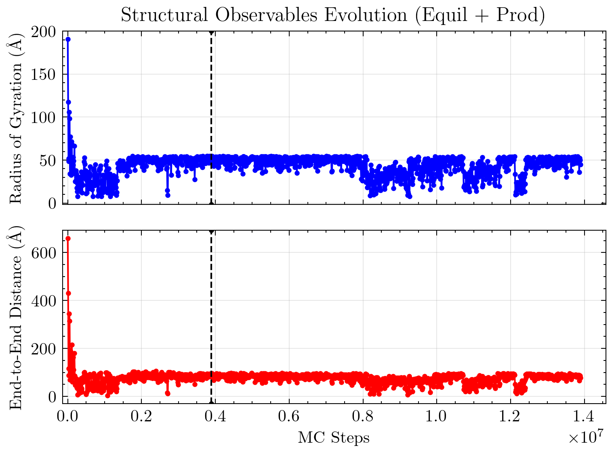
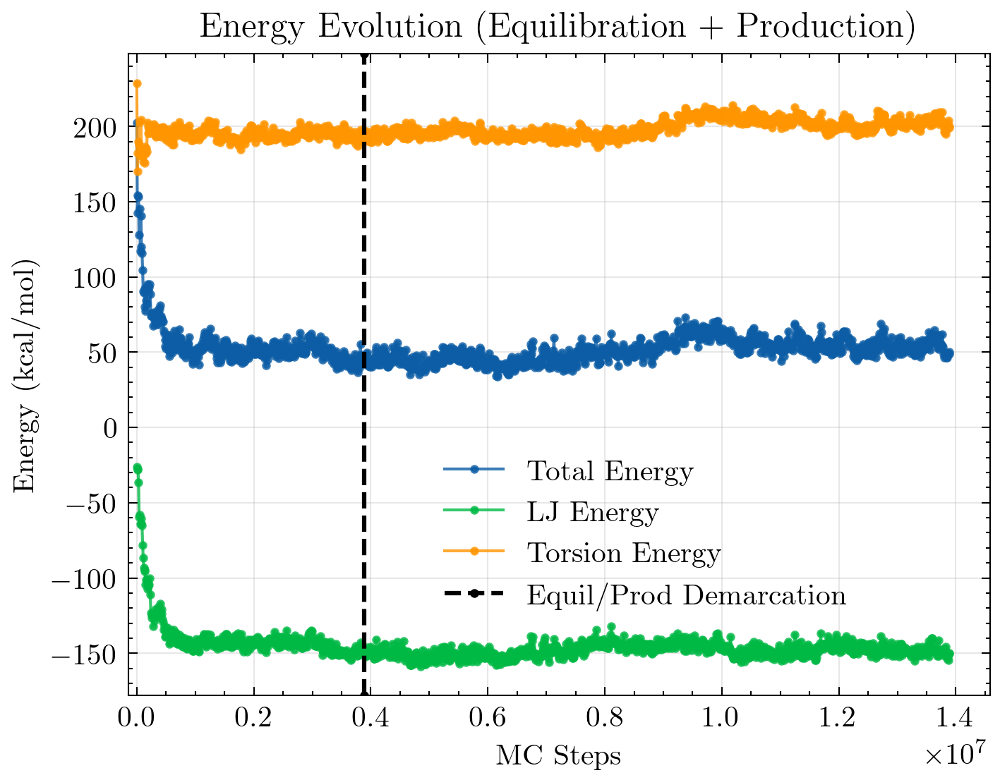
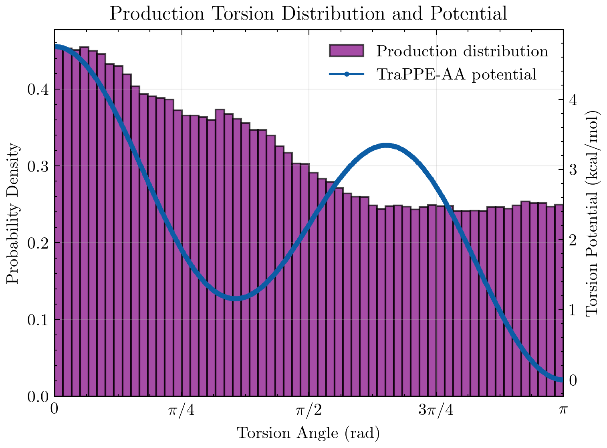
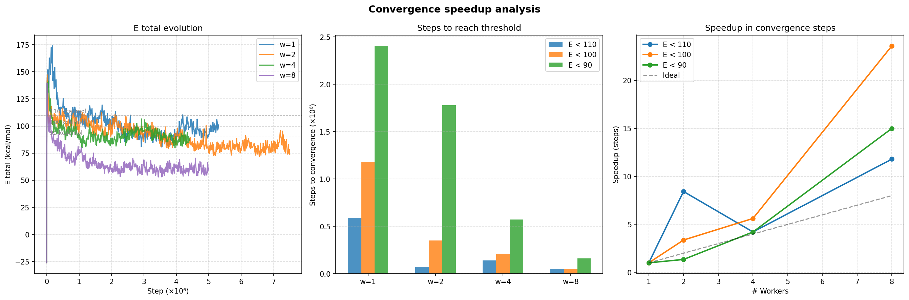
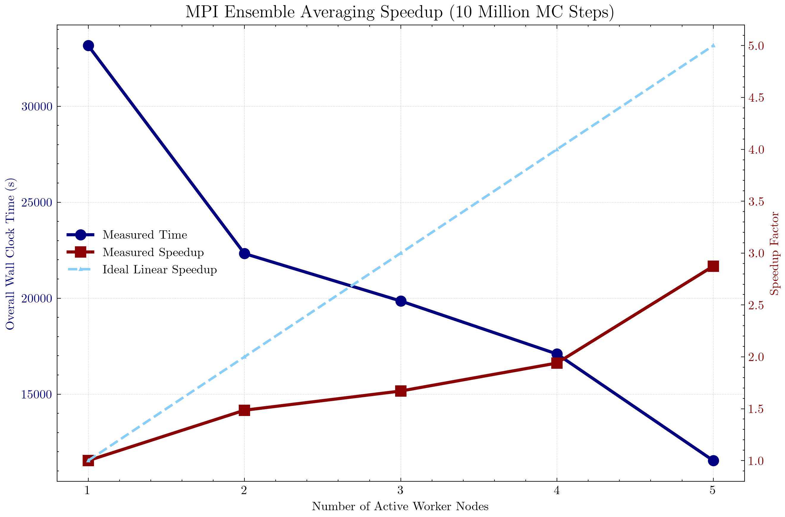
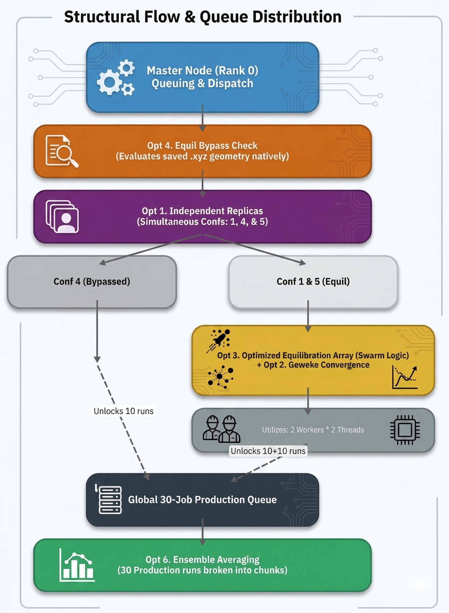

# **Monte Carlo Simulation of a Simple Polymer Chain**

<p align='right'>
 12 April 2026 
</p>


## Team **Project_2026_II**

| Name | Github | Files (Principal Author) | Parallelization Contributions |
| ---- | ------ | ----------------------- | ----------------------------- |
| MANEL DÍAZ CALVO | ManelDC55 | Monte Carlo, qsub script, Plotting* | Equilibration Optimization |
| OLIWIER MISZTAL | omisztal | Energy, Shell Scripts, Plotting* | Energy Calculations |
| ITXASO MUÑOZ ALDALUR | itxasoma | Initial Configurations, Shell Scripts, File I/O, Plotting* | Independent Replicas, Orchestrator Read/Broadcasting, Trajectory Parsing |
| ARTHUR IAN MURPHY (_Project Leader_) | ai-murphy | Makefile, Main, Observables, Plotting* | Ensemble Averaging |

<br>

## Project Overview 

In this assignment, our goal was to develop a Monte Carlo simulation program to explore the conformational landscape of a 500-Carbon linear polymer chain (polyethylene) with varying torsional angles. The simulation generates the initial conformation (with & without Hydrogens), measures torsional energy rotations, end-to-end distance, and intramolecular Lennard-Jones interactions, and finally analyzes & visualizes the results. 

After creating a serial processing version of the program, parallelization techniques involving both MPI and OpenMP were incorporated. These were compared to the serial version to demonstrate both their individual and combined High Performance Computing capabilities & benefits. 

Many techniques taught in class were crucial in the development of this program, including:
- **Git/Github** as a code respository & teamwork coordination platform
- **Makefile** to automate the compilation and execution of the code
- **Shell scripting** for facilitating server deployment
- **MPI & openMP** to parallelize the code
- **Python** for post-processing and plotting

<br>

## Repository Structure

Github was used as our team's code repository management system, and from the root of [the project](https://github.com/Eines-Informatiques-Avancades/Project_2026_II), the code is divided among 3 main folders: `src`, `results`, and `docs`. 

- `src` contains:
  - Makefile & shell scripts
  - Various versions of the main program (serial & parallel)
  - A `confs` folder where initial configurations are stored and compile-time options can be controlled via a file called `input.dat` 
  - A `lib` folder where module source files, python analysis files, and plotting style dependencies reside (_further detail below_)
- `results` contains the output data from the simulations
- `docs` contains documentation and reports, including `img` folder for embedded images

<br> 

In addition to these folders, a customary `README` file is included in the root directory detailing run instructions and code dependencies/requirements. The bulk of the code is written in Fortran, while the post-processing is done in Python.


  ### Module Library Introduction
  The following modules support the _`main...f90`_ files:
  - `energy.f90` & `energy_all_atoms.f90` - Permit **dual energy modes**, computing energetic contributions using either TraPPE-UA or OPLS-AA (with effective backbone potentials) depending on the `explicit_h` toggle dynamically read from `input.dat`.
  - `initial-conf.f90` - Generates initial configuration of the polymer chain.
  - `io.f90` - File input/ouput module.
  - `monte_carlo.f90` - Provides the rotation algorithm and subroutine MCS step used to update spatial configurations.
  - `observables.f90` - Computes the structural observables: End-to-end distance ($R_{ee}$), Radius of Gyration ($R_g$), and torsion angles.
  - `parameters.f90` - Stores global parameters abstracted from _`main...f90`_ code. Works in tandem with `input.dat` settings.
  - _`plot_...py`_ files - Various scripts used for plotting observables and serial vs parallel code comparisons. 
  - `requirements.txt` - List of python module dependencies.
  - `science.mplstyle` - stylized document used in plotting to control visualization theme.

<br>

## Code Management via Github

The project leader was responsible for reviewing all pull requests, ensuring that the code followed the project guidelines, and merging the code into the main branch. The team coordinated through a WhatsApp group chat and would regularly check in on each other's progress. Everyone was informed when code was merged so we could all pull the latest changes.

Most times, approving and merging was straightforward with no issues, but there was an interesting challenge when multiple uploads from different team members overlapped, causing conflicts. This forced us to learn about stashing and rebasing to the newly updated master branch before recommitting. The following process was ironed out to ensure a smooth integration:

1. Stash local (uncommitted) changes
   ```bash
      git stash
   ```
2. Pull latest changes from master branch
   ```bash
      git checkout master
      git pull main master
   ```
3. Rebase local changes onto master branch so it starts after the new merged code
   ```bash
      git checkout <fork-feature>/<fork-branch>
      git rebase master
   ```
4. Resolve any conflicts & re-apply stashed changes
   ```bash
      git stash pop
   ```
5. Commit and push (using ```--force``` parameter due to rebase)
   ```bash
      git push <fork-remote> <fork-branch> --force
   ```

<br>


## Makefile

As the project evolved, so did the Makefile. Here are some of the features we implemented:

<br>

Starting off, there are few main variables that control the compilation process. 

```makefile
FC       = gfortran
FFLAGS   = -O2 -Wall -Wextra
OBJ_DIR  = ../bin
EXE      = $(OBJ_DIR)/main_serial.x
LIB_OBJ  = $(OBJ_DIR)/parameters.o \
           $(OBJ_DIR)/io.o \
           ...
MAIN_OBJ = $(OBJ_DIR)/main_serial.o

NP          ?= 4
OMP_THREADS ?= 2
```
-  ```FC```: Stands for "Fortran Compiler". We tell it to use gfortran.
-  ```FFLAGS```: These are the compiler flags. ```-O2``` is the optimization schema, and ```-Wall -Wextra``` enables warnings.
-  ```OBJ_DIR``` & ```EXE```: Defines the compiled binaries directory and the name of the final executable.
-  ```LIB_OBJ``` & ```MAIN_OBJ```: Defines the object files for the library and the main program.
-  ```NP``` & ```OMP_THREADS```: Defines the number of processes (MPI) and threads (openMP) to use for the parallel version of the program. The default values are set to 4 and 2, respectively, but they can be overridden by setting them when compiling in the command line (e.g., ```make run_parallel NP=7 OMP_THREADS=3```).

<br>

In order to encompass both the serial and parallel versions of the program, a check is performed on the `make` command entered on the command-line for the word `parallel`. If found, the user's system is searched to ensure the environment has the necessary MPI and OpenMP libraries installed. If not, an error message is printed and the program exits. If they are installed, the compiler variable `FC` is overwritten and the MPI and OpenMP flags are added to the `FFLAGS` variable.

```makefile
ifneq (,$(findstring parallel,$(MAKECMDGOALS)))
  # MPI Compiler Wrapper Verification
  MPI_BIN := $(shell command -v mpif90 2>/dev/null)
  ifeq ($(strip $(MPI_BIN)),)
    $(error "MPI Compiler is required but 'mpif90' was not found! Please install it (e.g. 'sudo apt install openmpi-bin')")
  endif
  # Overwrite Compiler for MPI parallelization flag linking
  FC = mpif90
  ...
```

<br>

Instead of writing a rule for every single ```.f90``` file, a pattern rule (with `%`) is used.

```makefile
$(OBJ_DIR)/%.o: lib/%.f90
	@mkdir -p $(OBJ_DIR)
	$(FC) $(FFLAGS) -J$(OBJ_DIR) -I$(OBJ_DIR) -c $< -o $@
```
-  It says: "To make any ```.o``` file in the object directory (```bin/```) from a matching ```.f90``` file in ```lib/```, run this command."
-  ```-c $<```: Compiles the "first dependency" (```$<```, which is the ```.f90``` file) without linking (because that's done in the ```$(EXE)``` target).
-  ```-J$(OBJ_DIR) -I$(OBJ_DIR)```: Tells Fortran to put module ```.mod``` files in the ```bin/``` folder.

<br>

The following is an example of the `all` target (serial version of the program) with its executable structure, which we then follow up with the explicit dependencies to create the ```.o``` files for the library modules and the main program

```makefile
all: $(EXE)

$(EXE): $(LIB_OBJ) $(MAIN_OBJ)
	@mkdir -p $(OBJ_DIR)
	$(FC) $(FFLAGS) -o $@ $(LIB_OBJ) $(MAIN_OBJ)

$(OBJ_DIR)/energy.o: lib/energy.f90 \
                     $(OBJ_DIR)/parameters.o
...

$(OBJ_DIR)/main_serial.o: main_serial.f90 $(LIB_OBJ)
	@mkdir -p $(OBJ_DIR)
	$(FC) $(FFLAGS) -J$(OBJ_DIR) -I$(OBJ_DIR) -c $< -o $@

```
-  ```all```: This is the default target that needs ```$(EXE)``` to exist.
-  ```$(EXE)```: To build the final executable, it needs all the .o files from the ```../bin``` folder, which it makes sure exists (```mkdir -p```), and then links them all together using ```gfortran``` or ```mpif90``` to output (```-o $@```) the final program.
   - **Note**: The ```@``` symbol is used 2 different ways here: 
      1. Before the ```mkdir``` command to suppress being printed to the terminal.
      2. As an automatic variable representing the target name (```$(EXE)``` in this case).


<br>

Last, we declare the shortcut commands as ```.PHONY``` targets to prevent conflicts with files that may have the same name as a target.

```makefile
.PHONY: all clean run figures pipeline

run: all
	@mkdir -p ../results
	$(EXE)

figures:
	python lib/plot_results.py

clean: 
	rm -rf $(OBJ_DIR)/*.o $(OBJ_DIR)/*.mod $(EXE)

pipeline:
	$(MAKE) run
	$(MAKE) figures
```
-  This enables the following compile-time shortcuts:
   - ```make run```: Automatically builds the code (```all```) and then executes it.
   - ```make figures```: Envokes python to generate the plots from the ```../results``` folder.
   - ```make clean```: Acts like a reset button, deleting all compiled files to start fresh.
   - ```make pipeline```: A neat wrapper we built to run the code and generate the python plots back-to-back.

<br>

## Shell Scripting

**Itxaso to add her bit here**

A qsub script `run_collab.qsub` was also written during the testing of the program to submit an individual portion of the simulation to the HPC cluster. It involved loading the appropriate modules for that queue, selecting a custom makefile (separate from the main program's Makefile), indentifying the correct commandline arguments to pass at compile time, and submit the mpirun command.

<br>

## Parallelization with MPI & OpenMP

To maximize the performance of the Monte Carlo simulation, we employed a hybrid parallelization strategy combining **MPI** (Message Passing Interface) and **OpenMP**.

While both serve to speed up code, they operate on fundamentally different paradigms:

- **MPI (Distributed Memory)**: Operates on an Orchestrator/Worker topology. It treats each core as a completely isolated computer with its own dedicated memory. In our code, MPI is responsible for the macro-level distribution of work—managing the dynamic job queue and sending independent 1-million-step production replicas to free worker cores.
- **OpenMP (Shared Memory)**: Operates within a single process. It allows multiple lightweight threads to temporarily share the same pool of memory. In our code, OpenMP is responsible for the micro-level heavy lifting—specifically parallelizing the nested $\mathcal{O}(N^2)$ Lennard-Jones interaction loops inside a single Monte Carlo step.

Combining these two frameworks is tricky. If left unchecked, $N$ MPI processes might each try to spawn $M$ OpenMP threads simultaneously. If $N \times M$ exceeds the physical number of CPU cores available, it leads to "oversubscription"—where performance gains are lost while the operating system wastes all its time context-switching between threads.

We mitigated this risk by enforcing strict administrative control through our Makefile compilation arguments (NP and OMP_THREADS). This gives the user explicit, compile-time authority to cleanly balance the execution matrix (e.g., forcing OMP_THREADS=1 during heavily populated MPI ensemble sampling) to prevent thread-collisions and ensure hardware resources are optimized efficiently.

Further detail of how the parallelization was implemented within the code itself is included in the [Parallelization Section](./EIA_Project2026_Report_GroupII.md#parallelization-techniques).


<br>

## Python Post-Processing

The visualization of our serial results is handled by `plot_results.py`. It starts by reading the input.dat file to determine whether the simulation was run using explicit hydrogens so it knows which theoretical potential to compare against.

Since equilibration and production phases have been bifurcated, the python script now reads the data from both phases and plots them together, separated by a vertical dashed line for both the energy and Radius of Gyration plots. The torsional distribution uses only the equilibrated production data.

There are 3 defined functions for each of the plots using matplotlib:
* ```plot_energies```: Plots the total energy, LJ energy, and torsion energy against the MC steps.
* ```plot_observables```: Plots the radius of gyration and end-to-end distance against the MC steps.
* ```plot_torsions```: Plots the torsion angles against the MC steps and compares them to the theoretical potential.

The most complex of these is the torsion distribution plot, which overlays our histogram data against the theoretical TraPPE potentials.

```python
def plot_torsions(tors_file, energy_file, explicit_h=True):
    if not explicit_h:
        c1, c2, c3 = 0.705, -0.135, 1.572
    else:
        c1, c2, c3 = 0.8700, -0.0785, 1.5075
    def torsion_potential(phi):
        return (c1 * (1.0 + np.cos(phi))
              + c2 * (1.0 - np.cos(2.0 * phi))
              + c3 * (1.0 + np.cos(3.0 * phi)))
```

- ```explicit_h```: The boolean passed from our parser function.
- ```c1, c2, c3```: The TraPPE-UA United Atom coefficients, or the OPLS-AA Effective Backbone coefficients, loaded depending on the simulation type.
- ```torsion_potential(phi)```: Returns the theoretical energy (in kcal/mol) for any given dihedral angle ($\phi$) using trigonometric identities, which is then overlaid on the secondary Y-axis spanning across the histograms.


**Itxaso to include:**
- Automated Equilibration Detection (\tau_int): the function inside. In plot_results.py
- ⁠plot_parallel_replicas.py results commented
- ⁠plot_parallel_observables_np.py results commented

<br>

## Monte Carlo Simulation Techniques and Theory

   ### Energy Calculations
   
   Designing and implementation of the energy evaluation modules, encompassed creating both the `energy.f90` and `energy_all_atoms.f90` files. These modules compute the system's total energy and handle the $\Delta E$ calculations required for the Metropolis acceptance/rejection criteria during Monte Carlo sampling. 
   
   ### United-Atom (UA) Model & TraPPE-UA Optimization
   For the United-Atom implementation, the focus was on computational throughput. The energy routines are called continuously during the MC loop, making performance highly dependent on the efficiency of these calculations.
   
   #### Trigonometric Bypasses in Dihedral Calculations 
   Calculating torsional energy typically requires evaluating the dihedral angle via expensive `acos` and `atan2` functions. To avoid this overhead, the `compute_cos_dihedral` function was written to compute the cosine of the angle directly using vector cross products and dot products of the normal vectors defined by the carbon backbone. 
   
   ```fortran
   ! Snippet from energy.f90: Direct cosine calculation
   pure function compute_cos_dihedral(r1, r2, r3, r4) result(cos_phi)
     ! ... variable declarations ...
     b1 = r2 - r1
     b2 = r3 - r2
     b3 = r4 - r3
   
     n1 = cross_product(b1, b2)
     n2 = cross_product(b2, b3)
   
     nn1 = sum(n1**2)
     nn2 = sum(n2**2)
   
     ! Guard against collinear atoms (zero-length normals)
     if (nn1 < 1.0d-28 .or. nn2 < 1.0d-28) then
       cos_phi = 1.0d0   ! default to trans
       return
     end if
   
     ! cos(phi) = (n1 . n2) / (|n1| * |n2|)
     cos_phi = dot_product(n1, n2) / (sqrt(nn1) * sqrt(nn2))
   end function compute_cos_dihedral
   ```
   
   #### Polynomial Expansion for TraPPE-UA
   The TraPPE-UA potential was integrated using the parameters defined by Martin & Siepmann (*J. Phys. Chem. B 102, 2569, 1998*)[2]. The original potential is defined using trigonometric functions: 
   
   $$U(\phi) = c_1(1 + \cos\phi) + c_2(1 - \cos(2\phi)) + c_3(1 + \cos(3\phi))$$
   
   By substituting $y = \cos\phi$ and applying trigonometric identities, the expression was reduced to a polynomial. This allows the torsion energy to be evaluated using only basic multiplication and addition, entirely eliminating transcendental function calls in the MC loop.
   
   ### Explicit Hydrogens and the OPLS-AA Force Field
   The transition to the explicit hydrogen model required handling a significantly more complex topology. To accurately capture the steric hindrance and phase behavior of all-atom polyethylene, the **OPLS-AA force field** was implemented. This represents a significant increase in computational complexity over the UA model, requiring specialized algorithmic workarounds.
   
   #### The OPLS-AA Parameterization & Effective Backbone Potential
   In a standard OPLS-AA implementation, rotating a single C-C bond in a polymer chain requires calculating the torsional energy of **9 distinct dihedrals** crossing that bond: one C-C-C-C, four C-C-C-H, and four H-C-C-H interactions. Evaluating all 9 angles at every Monte Carlo step would be computationally prohibitive and bottleneck the simulation.
   
   To solve this, I implemented an **"Effective Backbone Potential"** based on the optimized OPLS-AA framework for polyethylene developed by Sæther et al. (*Macromolecules 2021*)[3]. This mathematical formulation collapses the energetic contributions of all 9 dihedrals into a single effective torsional equation that only requires the coordinates of the carbon backbone (C-C-C-C). 
   
   Using the pre-computed `opls_c1`, `opls_c2`, and `opls_c3` effective parameters, the code retains the rigorous physical accuracy of the all-atom force field while operating at the speed of a united-atom calculation. The polynomial expansion used in the UA model was adapted for these new OPLS-AA coefficients:
   
   ```fortran
   ! Snippet from energy_all_atoms.f90: OPLS-AA Effective Potential evaluation
   pure function torsion_single(cos_phi) result(e)
     double precision, intent(in) :: cos_phi
     double precision :: e, y, y2, y3
   
     y = cos_phi   ! corresponds to trans = -1, cis = 1
     y2 = y * y
     y3 = y2 * y
   
     ! OPLS-AA evaluation using trigonometric identities
     ! cos(2x) = 2*cos^2(x) - 1 => 1 - cos(2x) = 2 - 2y^2
     ! cos(3x) = 4*cos^3(x) - 3*cos(x) => 1 + cos(3x) = 1 - 3y + 4y^3
     e = opls_c1 * (1.0d0 + y) &
       + opls_c2 * (2.0d0 - 2.0d0 * y2) &
       + opls_c3 * (1.0d0 - 3.0d0 * y + 4.0d0 * y3)
   end function torsion_single
   ```
   
   #### Topology Mapping and Exclusion Matrix
   In the AA model, non-bonded Lennard-Jones interactions must be excluded for atoms separated by fewer than four bonds (1-2, 1-3, and 1-4 interactions) to prevent double-counting energies already captured by bond/angle/torsion parameters. An initialization routine, `init_energy_topology`, was built to dynamically map hydrogen atoms to their parent carbon atoms based on geometric distance. This mapping is then used to construct a global boolean matrix (`is_excluded`) that instantly determines if a given C-C, C-H, or H-H pair should bypass LJ evaluation.
   
   #### Dynamic Atom Lists for Rigid-Body Moves
   For the `delta_energy` subroutine in the AA model, recalculating the entire energy of the chain or blindly checking every atom pair is highly inefficient. Instead, the algorithm dynamically identifies which atoms moved during a pivot step and sorts their indices into stack-allocated arrays (`fixed_list` and `moved_list`). 
   
   ```fortran
   ! Snippet from energy_all_atoms.f90: Dynamic lists for delta E
   n_fixed = 0
   n_moved = 0
   do i = 1, n_atoms
      if (sum((coords_new(i,:) - coords_old(i,:))**2) > 1.0d-12) then
        n_moved = n_moved + 1
        moved_list(n_moved) = i
      else
        n_fixed = n_fixed + 1
        fixed_list(n_fixed) = i
      end if
   end do
   ```
   By isolating these lists, the $\Delta E$ loop exclusively processes LJ interactions between atoms that have actually changed their relative distance. Using a secondary `pair_type_matrix`, the code instantly routes valid interactions to the appropriate C-C, C-H, or H-H pre-computed Lennard-Jones parameters, ensuring high throughput during dense all-atom calculations.

<br>

### Monte Carlo Rotation & Step Process

   #### Implementation of the Pivot Move
   The core conformational sampling mechanism is the pivot move, implemented within the `rotate_dihedral` subroutine. Rather than performing local perturbations, the pivot move selects a random bond along the chain and rotates the entire subsequent segment (the "tail") as a rigid body.
   
   To perform the rotation without distorting bond lengths or bond angles, Rodrigues' rotation formula is used. Given a vector $\vec{v}$ representing an atom's position relative to the pivot point, a unit rotation axis $\hat{k}$ (the chosen C–C bond direction), and a rotation angle $\phi$, the rotated vector is:

   $$\vec{v}_{\,\text{rot}} = \vec{v}\cos\phi + (\hat{k} \times \vec{v})\sin\phi + \hat{k}\,(\hat{k} \cdot \vec{v})(1 - \cos\phi)$$
   
   The formula decomposes the rotation into three contributions: a scaled version of the original vector, a cross-product term that generates the perpendicular component, and a projection term that preserves the component parallel to the axis.
   
   #### Handling $sp^3$ Hybridization in All-Atom (AA) Mode
   
   When explicit hydrogens are included (all-atom mode), the rotation must also displace the two hydrogens attached to each rotating carbon. Because of the $sp^3$ hybridisation, both hydrogens must rotate with exactly the same axis and angle as their parent carbon; any deviation would alter C–H bond lengths or C–C–H angles, producing non-physical geometries that would be immediately rejected by the Metropolis criterion.
   
   The implementation identifies each hydrogen by checking whether the distance to a rotating carbon falls below the C–H bond threshold of $1.2\,\text{Å}$, then applies the rotation formula with the same pivot, axis, and angle:
   
   ```fortran
   if (explicit_h) then
     ! Hydrogens are stored after the carbon backbone in the coords array
     do i = n_carbons + 1, n_atoms
       do j = k + 1, n_carbons
         ! Identify if hydrogen i is bonded to the moving carbon j
         v = coords(i, :) - coords(j, :)
         if (vnorm(v) < 1.2d0) then
           ! Apply Rodrigues' rotation relative to the pivot point
           v = coords(i, :) - pivot
           dot_uv = sum(axis * v)
           v_rot = v * cos_p + cross(axis, v) * sin_p &
                 + axis * dot_uv * (1.0d0 - cos_p)
           coords_new(i, :) = pivot + v_rot
           exit  ! Hydrogen found, move to the next atom
         end if
       end do
     end do
   end if
   ```

   #### The MC Step and Metropolis Criterion
   
   Each call to mc_step constitutes one trial move of the simulation. The    subroutine follows four stages:
   
   *1. Proposal generation.* A random internal bond index $k$ is drawn    uniformly from $[1,\, N_C - 2]$, and a random rotation angle $\phi$ is    sampled uniformly from $[-\Delta\phi_{\max},\, \Delta\phi_{\max}]$. The    parameter max_delta controls the maximum displacement and is tuned to    achieve a reasonable acceptance rate.
   
   *2. Trial configuration.* rotate_dihedral is called with the chosen $k$ and    $\phi$ to produce coords_new, leaving the original coordinates untouched.
   
   *3. Energy difference.* Rather than recomputing the full energy of the new    configuration, an optimized $\Delta E$ function is used that only    recalculates the interactions affected by the rotation. Two code paths    exist depending on the model: delta_energy_aa for all-atom mode and    delta_energy_ua for united-atom mode, dispatched via the explicit_h flag.
   
   *4. Metropolis acceptance.* The move is accepted unconditionally if $\Delta    E < 0$. Otherwise, it is accepted with probability $\exp(-\beta \,\Delta E)   $, where $\beta = 1/(k_B T)$. If accepted, coords and the energy    accumulators are updated in place; if rejected, the trial configuration is    discarded.
   
   ```fortran
   ! d. Metropolis acceptance criterion
   call random_number(random_value)
   if (dE < 0.0d0 .or. random_value < exp(-beta * dE)) then
     coords  = coords_new
     E_total = E_total + dE
     E_lj    = E_lj    + dE_lj
     E_tors  = E_tors  + dE_tors
     accepted = .true.
   end if
   ```

<br>

### Geweke Conversion Detection (Dynamic Runtime Equilibration)

Previously, the simulation relied on an arbitrary 10-million step burn-in process and a post-processing python Fast-Fourier Transform (FFT) script to determine the integrated autocorrelation time ($\tau_{int}$) and "guess" when the simulation had equilibrated over time. However this often failed to properly truncate the data arrays and output that the production portion of the simulation was 0% of the 10M steps if consecutive correlations tricked the variance boundaries.

By rewriting the Fortran baseline to include the mathematical **Geweke Convergence Diagnostic** (Geweke J. 1992)$^[1]$ at runtime, the simulation now dynamically assesses the standard error computed through batch means between early and late moving-average windows and physically halts the "Equilibration Phase" the exact moment $Z < 1.96$ is satisfied across 3 consecutive checks. The production phase then natively restarts step counting from 1. 

Detecting equilibration of a Markov chain is non-trivial because successive samples are highly correlated. The Geweke diagnostic was used, as it is designed specifically for Markov chain output and accounts for this autocorrelation.

The test compares the mean energy in the first $f_A = 10\%$ of an accumulated buffer of $N = 300$ energy samples against the mean in the last $f_B = 50\%$:

$$z = \frac{\bar{x}_A - \bar{x}_B}{\sqrt{SE_A^2 + SE_B^2}}$$

Here, $SE_A$ and $SE_B$ represent the Standard Errors of the mean energy for window A and window B, respectively. They measure the statistical uncertainty of our calculated averages.

In a dataset of independent measurements, calculating the standard error is straightforward. However, Monte Carlo trajectories are autocorrelated — each new geometry is simply the previous one with a slight rotation. If we computed $SE_A$ and $SE_B$ directly from the raw sample variance, the autocorrelation would cause us to drastically underestimate the error, tricking the algorithm into declaring a false equilibrium.

To solve this, the code computes $SE_A$ and $SE_B$ using batch means. The $n_A$
samples of window A are divided into $b_A = \lfloor\sqrt{n_A}\rfloor$ contiguous
blocks of equal size, and $SE_A^2$ is estimated as the variance of the block means:

$$SE_A^2 = \frac{1}{b_A(b_A-1)}\sum_{i=1}^{b_A}\left(\bar{x}_i - \bar{x}_A\right)^2$$

where $\bar{x}_i$ is the mean of block $i$ and $\bar{x}_A$ is the mean of the
full window. Because block means of sufficiently large blocks behave approximately
as independent, this estimator correctly absorbs the autocorrelation structure of
the chain. $SE_B^2$ is computed analogously over window B. With $n_A = 30$ and
$n_B = 150$ samples respectively, this gives $b_A = 5$ and $b_B = 12$ blocks.

Under the null hypothesis of stationarity, $z$ follows a standard normal distribution. Equilibrium is accepted when $|z| < z_{\text{crit}} = 1.96$ (95% confidence level) on $n_{\text{consec}} = 3$ consecutive evaluations, preventing false positives caused by temporary plateaus. The test is re-evaluated every `eval_freq` synchronisation points once the buffer is full.

<br>

## Main Program Workflow Notes

Since the initial code submission, we have updated the serial version of our file `main_serial_equil.f90` to incorporate an equilibration check based on the Geweke equilibration diagnostic (Geweke, J. 1992)[1]. Specifically designed for Markov Chain Monte Carlo simulations, this technique allows us to separate the simulation into equilibration and production phases during runtime as opposed to analyzing the results afterwards. It also allows us to identify and save an equilibrated geometry which can then be used to save time by bypassing the initial phase. 

<br>

The simulation begins by reading in the configurations from `input.dat` and building the starting coordinates. If these are not overwritten by a previously saved equilibration .xyz file, the program will initialize and enter **Phase 1: Equilibration**.

```fortran
  do while (.not. is_equilibrated)
    istep = istep + 1

    ! Annealing:
    if (istep <= n_steps) then
      T = T_ini - dT * dble(istep - 1)
    else
      T = T_fin
    end if
    
    ! Monte Carlo Step
    call mc_step(n_carbons, n_atoms, coords, symbols, explicit_h, &
                 beta, max_delta, E_total, E_lj, E_tors, accepted_step)
    
    if (accepted_step) total_accepted = total_accepted + 1

    ! Output periodically
    if (mod(istep, print_interval) == 0 .or. istep == 1) then
      ! Energies
      write(u_ener, '(I10, 3F15.4)') istep, E_total, E_lj, E_tors

      ! Observables
      rg2 = compute_rg(n_carbons, coords)
      ree2 = compute_end_to_end(n_carbons, coords)
      write(u_obs, '(I10, 2F15.4)') istep, sqrt(rg2), sqrt(ree2)
      ...
```
- `do while (.not. is_equilibrated)`: Replaces traditional hard-coded burn-in periods with a dynamic loop that stays alive until equilibration is met.
- `T = T_ini - dT * dble(istep - 1)`: We had originally discussed introducing simulated annealing to help the simulation escape local minima, however the project instructions say to assume a fixed temperature. This portion of the code was left in case we wanted to set T_ini & T_fin to different values. 
- `call mc_step(...)`: Subroutine to perform a single Monte Carlo step.
- We control when to compute & store the observables (energy, torsion, trajectory, etc) based on the `print_interval` variable.

<br>

The parallel version of the program implements a much more sophisticated workflow, separating tasks between a main orchestrator and worker nodes. This is discussed in further detail in the [Parallelization Techniques](./EIA_Project2026_Report_GroupII.md#parallelization-techniques) section.

<br>

## Serial Version Simulation Results

The serial version of our simulation starts with an equilibration run followed by a 10,000,000 MCS production run for a 500-carbon linear polymer molecule with explicit hydrogens at 300K. The dihedral angle was initially set to 15 degrees and then randomly selected between -$\pi$ and $\pi$. 


_Fig 1. Initial configuration of the 500-carbon linear polymer molecule with explicit hydrogens at 300K._


_Fig 2. Final configuration of the 500-carbon linear polymer molecule with explicit hydrogens at 300K._


The python plotting scripts were rewritten to seamlessly stitch these separate equilibration & production outputs together across a time-demarcation boundary:

#### **Radius of Gyration & End-to-End Sequence (Equilibration & Production)**
The polymer begins in an ultra-extended 500-Carbon length chain with fixed 15-degree dihedrals ($R_g \approx 200$ Å, $R_{ee} \approx 600$ Å), but the random MC modifications rapidly introduce folds. The Geweke algorithm successfully caught the structural collapse around 3.9 million steps (denoted by the vertical dashed demarcation line). Everything to the right of the dashed line behaves exactly as a natural random coil distribution with stable radial bounds.



#### **Energy Evolution (Equilibration & Production)**
The initial massive spike down for the Lennard-Jones (LJ) energy clearly captures the steric clash resolving as the linear atoms drift off the fixed 15-degree axis. Following the Geweke demarcation line at ~3.9M steps, the Total Energy securely flatlines near $50$ kcal/mol, mathematically verifying the conformation search has truly relaxed.



#### **Torsional Distribution (Pure Production)**
Plotting the torsional geometry using *only* the production results, the distribution favors values near $0$ rad (trans). While the distribution should _theoretically_ mimic the OPLS-AA potential, the results show a deviation due to the simulation's preference towards lowering the steric resistance (LJ interactions) over the total energy. If the latter were preferred, the polymer wouldn't coil; it would elongate as in the initial conformation. 



**Why does the polymer coil instead of staying elongated?**

In these specific simulations there is also a competition between entropy and energy. As we simulate at 300K, the entropic contribution to the total energy is significant. Considering entropy is proportional to the number of available microstates, combined with the probablistic nature of MCMC simulations, the probability of the chain staying at an optimal low energy state is overridden by the subjection to a 300K temperature environment. As such, the polymer coils as it attempts to find an equilibrium between lowering the energy and getting to a high entropy state.

_**Why doesn't the torsional distribution follow the potential?**_

**Oliwier to write a note about exclusion of LJ for 1-4 w C, 1-5/6 with H**

Here is why your simulation heavily favors $0$ radians (a cis-like geometry) despite the standard theoretical TraPPE/OPLS polynomial assigning it the highest energy ($\sim +4.755 \text{ kcal/mol}$):

1. **Exclusion of the 1-4 Steric Repulsion**

   The primary physical effect that prevents polymer chains from curling back onto themselves to form an exact $0$ torsion angle is the extreme steric clash between atoms located across the exact bond, which are a distance of 1-4 bonds apart. If we look at how topology is mapped in energy_all_atoms.f90, we see this logic:

   ```fortran
   ! If atoms are attached to carbons separated by fewer than 4 bonds, exclude LJ
   if (abs(backbone_pos(i) - backbone_pos(j)) < 4) then
     is_excluded(i, j) = .true.
   end if
   ```

   This is a standard molecular mechanics trick since the effective torsional potentials (opls_c1, opls_c2, etc.) supposedly absorb the 1-4 interactions. However, by blindly turning is_excluded = .true. for all Hydrogen-based interactions separated by fewer than 4 bonds, the massive van-der-Waals repulsive core of the explicit Hydrogen atoms across the bond is mathematically completely ignored by the simulation.

2. **Massive 1-5+ Lennard-Jones Attraction**

   Because the repulsive boundary is artificially turned off, the simulation's MC engine evaluates the energy of the geometry entirely based on how well it can compact the rest of the chain.

   When explicit hydrogens are included, a highly coiled and overlapped structure (which equates to consecutive $\sim 0$ torsion angles) brings the 1-5, 1-6, and 1-n explicit hydrogens into perfectly contiguous contact. This dense globule packing results in massive Lennard-Jones attractive energy (from slipping perfectly into the $2^{1/6}\sigma$ energy well across hundreds of interatomic pairs).

   Summary of the Physics: The simulation discovers that the dense stacking "reward" of collapsing dozens of explicit Hydrogens far exceeds the purely mathematical $\sim +4.7$ kcal/mol torsional "penalty" of having $\phi$ near $0$. Since the algorithm utilizes the Metropolis criterion purely on the Total Energy (E_tot = E_lj + E_tors), it continuously aggregates toward the $0$ radian well.

   If you eventually decide to expand the precision of this simulation, introducing a standard scaling rule mechanism like a scale_14 = 0.5 modifier for standard 1-4 Lennard-Jones explicit interactions inside the delta_energy function, instead of absolute exclusion, would rapidly restore the local minimum clusters expected naturally back to your diagram!

<br>

## Parallelization Techniques

### Independent Replicas

- **Itxaso to stitch**

### Orchestrator Initial Config Read & Broadcast

- **Itxaso to stitch**

### Equilibration Optimization

Rather than assigning a single worker to equilibrate each configuration type independently, a group of `workers_per_equil` MPI workers is assigned to each configuration type simultaneously. Each worker starts from the same initial geometry but with a different random seed (`rng_seed + rank × 104729`), ensuring that trajectories immediately diverge and explore distinct regions of conformational space.

Every `sync_interval` MC steps, a synchronisation protocol is executed: each worker sends its current energy and $R_g$ to the master, which selects the most representative configuration via a Boltzmann-weighted roulette wheel and broadcasts those coordinates back to the non-winning workers in the group. The winning worker continues its trajectory uninterrupted, preserving the best conformational path found so far.

#### Replica Selection: Boltzmann Roulette Wheel

At each synchronisation point, the master assigns a statistical weight to each replica $i$ based on its total energy $E_i$:

$$w_i = \exp\!\left(-\frac{E_i - E_{\min}}{k_B \, T_{\text{virt}}}\right)$$

where $E_{\min}$ is the lowest energy in the current group and $T_{\text{virt}}$ is a virtual temperature — a purely algorithmic parameter with no physical meaning. It controls how aggressively low-energy replicas are favoured:

- $T_{\text{virt}} \to 0$: deterministic selection of the minimum-energy replica.
- $T_{\text{virt}} \to \infty$: uniform selection, ignoring energies.

A uniform random number then samples this distribution via roulette-wheel selection, and the selected replica's coordinates are sent to the non-winning workers:

```fortran
E_min_grp = minval(grp_energies)
do w = 1, workers_per_equil
  grp_boltz(w) = exp(-(grp_energies(w) - E_min_grp) / (kb * T_virt))
end do
tw = sum(grp_boltz)
call random_number(r_pick)
accum = 0.0d0
best_local = workers_per_equil
do w = 1, workers_per_equil
  accum = accum + grp_boltz(w) / tw
  if (r_pick <= accum) then
    best_local = w
    exit
  end if
end do
```
#### MPI Communication Protocol

The synchronisation uses only point-to-point MPI operations (`MPI_Send` / `MPI_Recv`) to avoid the need for temporary communicators or collective operations across worker subgroups. At each sync point, the master loops over all $K$ workers in the active equilibration group:

| Step | Direction | Tag | Content |
|------|-----------|-----|---------|
| 1 | worker → master | `TAG_SYNC_OBS` | $[E_{\text{total}},\, R_g^2]$ |
| 2 | master → worker | `TAG_SYNC_CTRL` | `[ctrl_signal, best_local_idx]` |
| 3 | worker → master | `TAG_EQUIL_COORDS` | full coordinate array |
| 4 | master → non-winners | `TAG_SYNC_COORDS` | winning coordinates |

Once the Geweke test declares equilibrium, the master saves the equilibrated geometry to `../results/equilibrated_cX.xyz` and unlocks the 10 production jobs for that configuration type in the task queue.

#### Metrics and Methodology

This section evaluates the performance of the equilibration optimization technique compared to the serial baseline. The system studied is configuration 1, a chain of 500 carbons at $T = 300\,\text{K}$ including hydrogens.

Efficiency is evaluated based on the time to reach specific energy thresholds ($E_{\text{total}} < 110,\, 100,\text{ and } 90$ kcal/mol). The speedup is defined as $S(w) = \text{Steps}_{\text{serial}} / \text{Steps}_{\text{parallel}}(w)$.

**Convergence Efficiency and Superlinear Speedup**

The table below summarises the number of MC steps required by different worker configurations to reach the target energy levels.

| Threshold | Workers ($w$) | Steps Required | Speedup $S(w)$ | Efficiency $S(w)/w$ |
|-----------|:-------------:|---------------:|:--------------:|:-------------------:|
| $E < 110$ kcal/mol | 1 | 590,000 | 1.00 | 1.00 |
| | 2 | 70,000 | 8.43 | 4.21 |
| | 4 | 140,000 | 4.21 | 1.05 |
| | 8 | 50,000 | 11.80 | 1.47 |
| $E < 100$ kcal/mol | 1 | 1,180,000 | 1.00 | 1.00 |
| | 2 | 350,000 | 3.37 | 1.68 |
| | 4 | 210,000 | 5.62 | 1.40 |
| | 8 | 50,000 | 23.60 | 2.95 |
| $E < 90$ kcal/mol | 1 | 2,400,000 | 1.00 | 1.00 |
| | 2 | 1,780,000 | 1.35 | 0.67 |
| | 4 | 570,000 | 4.21 | 1.05 |
| | 8 | 160,000 | 15.00 | 1.87 |

<br>


_Convergence speedup analysis. Left: evolution of $E_\text{total}$ for each worker configuration. Centre: MC steps required to reach each energy threshold. Right: speedup $S(w)$ relative to the serial run; the dashed line shows ideal linear scaling._

<br>

The results demonstrate a clear superlinear speedup ($S(w) > w$) in almost all parallel configurations. This phenomenon is a direct consequence of the collaborative sampling strategy implemented via the Boltzmann roulette wheel.

In the serial run, the polymer chain often becomes trapped in metastable states (local energy minima). The parallel implementation, by maintaining a population of $w$ independent trajectories, significantly increases the probability that at least one replica discovers a more favorable region of the phase space. Once a lower-energy conformation is found, the synchronization protocol "rescues" the rest of the population, broadcasting the winning coordinates to all workers. This creates a collective escape mechanism that reduces the number of steps required to converge by a factor far greater than the number of processors.

For instance, at the 100 kcal/mol threshold, the 8-worker group reaches the target in only 50,000 steps, compared to the 1.18 million steps required by the serial run, resulting in a speedup of **23.60×**.

We also observe stochastic fluctuations typical of Monte Carlo methods, such as the anomalous efficiency at $w=2$ for the 110 kcal/mol threshold. As the energy targets become more stringent (90 kcal/mol), the speedup values tend to stabilize, as finding further conformational improvements becomes more difficult even for a larger population.

### Energy Calculations

#### `compute_total_energy`

The dominant cost in `compute_total_energy` is the $\mathcal{O}(N^2)$ double loop over non-bonded LJ pairs. Each iteration is independent — it reads a pair of coordinates, evaluates `lj_pair_energy`, and adds to a running sum — which makes it a natural fit for OpenMP worksharing. The outer loop over `i` is distributed across threads with `!$omp parallel do`, with the inner index `j`, the squared distance `r2`, and the dihedral cosine `cos_phi` declared private to prevent cross-thread interference. The global accumulators `e_lj` and `e_tors` are aggregated safely with a `reduction(+:...)` clause.

The two loops inside the subroutine have different iteration structures and were scheduled accordingly. The LJ pair loop has a triangular iteration space (the inner bound depends on `i`), so `schedule(dynamic, 10)` is used to prevent faster threads from sitting idle while slower ones finish large inner loops. The torsional loop over the carbon backbone is uniform in length and uses the default static scheduling, which has lower overhead when the workload is balanced.

Both parallel regions are wrapped in an `if(omp_total_energy)` runtime guard, which is set from the input file. This allows the same binary to run in purely serial mode during development or lightweight tests without any code changes.

#### `delta_energy`

The `delta_energy` subroutine is the true bottleneck of the MC loop — it is called once per accepted or rejected move, millions of times per simulation. The key algorithmic feature here is the dynamic partitioning of atoms into `fixed_list` and `moved_list` at the start of each call. Only cross-interactions between fixed and moved atoms can have changed during a pivot, so the LJ loop processes exclusively those pairs rather than the full $\mathcal{O}(N^2)$ set.

The two nested loops over `f` (fixed) and `m` (moved) form a perfectly rectangular iteration space, which makes `collapse(2)` effective: it merges both loops into a single flat range of `n_fixed × n_moved` iterations and distributes them evenly across threads. Since pivot moves near chain ends move very few atoms, spawning threads for a handful of pairs would cost more than it saves. The parallel block is therefore gated by `if(omp_delta_energy .and. (n_fixed * n_moved > 1000))`, ensuring parallelization is only activated when the workload genuinely justifies it.

#### Benchmarking Code

To quantify the effect of thread count on both energy routines, a dedicated benchmark program `main_bench_total.f90` was written. It performs 10,000 back-to-back calls to `compute_total_energy` for a given chain size and reports the wall time via MPI_Wtime. Two shell scripts automate the full benchmark sweeps: `4.run_omp_total_test.sh` compiles and runs the benchmark binary across thread counts of 1, 2, 3, and 4 for chain sizes of 20, 50, 100, and 500 carbons, writing results to a CSV in `results/bench_omp_total/`. 

`5.run_omp_delta_test.sh` follows the same structure but targets `delta_energy` by running full 1M-step MC simulations via `main_parallel_replicas.x` and extracting wall time from the CPU output files. Both scripts are written for the `cerqt01.q` cluster queue and load the appropriate MPI module. The results are plotted by `plot_benchmarks.py`, which reads both CSVs and produces per-chain-size scaling plots as PDFs.

**Oliwier to add images/results/analysis, plus talk about benchmarking being affected by randomness**

#### SIMD Exploration

An attempt was made to additionally exploit single-core SIMD vectorization on the `lj_pair_energy` function using the `!$omp declare simd` directive. The idea was to generate a vectorized variant of the function callable from an `!$omp simd`-annotated inner loop, allowing each thread to process multiple atom pairs simultaneously using AVX registers. In practice, activating this required structural changes to `delta_energy` that conflicted with the existing threading design: the `collapse(2)` clause and the inner-loop cycle on `is_excluded` are incompatible with SIMD regions, and removing them to support vectorization degraded the thread load balancing that `collapse(2)` provides. Given that the OpenMP threading was the primary parallelization goal, the SIMD experiment was abandoned and the directive was removed from the code. It remains a direction worth revisiting, particularly if the pair loops were refactored to use pre-filtered pair lists that eliminate the exclusion branch entirely.

### Ensemble Averaging

Moving to an Orchestrator-Worker (Star) topology helped with the transition of the serial environment to a dynamically balanced parallel framework with OpenMPI. It achieves maximum CPU utilization by ensuring free workers are constantly assigned tasks until the simulation is complete.

<br>

Although this architechure adds overhead by requiring a single core to abstain from participating in the simulation's calculations, the orchestrator node performs the administrative tasks such as the initial file reading as well as organizing and distributing the workload. This relies upon tags being sent between the nodes to coordinate the simulation.

```fortran
  ! MPI Tags
  integer, parameter :: TAG_REQUEST_WORK = 1
  integer, parameter :: TAG_DO_EQUIL     = 2
  integer, parameter :: TAG_DO_PROD      = 3
  integer, parameter :: TAG_WAIT         = 4
  integer, parameter :: TAG_DIE          = 5
  integer, parameter :: TAG_EQUIL_DONE   = 6
  integer, parameter :: TAG_PROD_DONE    = 7
```


First, the simulation is cleanly segregated into phases where the **Orchestrator Node** acts as a central dispatcher:

```fortran
      do while (completed_prods < size(prod_queue))
         ! Wait for any worker to finish its task and ask for more
         call MPI_Recv(msg, 1, MPI_INTEGER, MPI_ANY_SOURCE, MPI_ANY_TAG, MPI_COMM_WORLD, status, ierr)
         sender = status(MPI_SOURCE)
         tag_recvd = status(MPI_TAG)
```
- `MPI_Recv`: The orchestrator lies in wait for any incoming communication from the worker nodes. 
- `MPI_ANY_SOURCE`: Instead of statically assigning jobs to specific processors up-front, the orchestrator listens to the *entire pool* of available cores. As soon as a worker node finishes its current 1-million-step job, it pings the orchestrator, which instantly deploys the next job from the queue directly to that specific idle worker, ensuring optimal resource utilization. 
- **Staged Execution**: By cleanly separating the logic phases, the orchestrator refuses to load the 10 production jobs into the queue until the prerequisite equilibration run officially finishes. The moment equilibration is met, jobs pop into the queue and cores are reused instantly, guaranteeing no resources are ever permanently "blocked" waiting in idle lines.

<br>

Once a worker has sent an incoming communication signal back to the orchestrator, the orchestrator checks the tag and executes the appropriate logic:

```fortran
         if (tag_recvd == TAG_EQUIL_DONE) then
           ! ... (Orchestrator caches the equilibrated .xyz coordinates and unlocks the production queue)
         else if (tag_recvd == TAG_PROD_DONE) then 
           ! ... (Orchestrator tallies the completed production run)
         end if

         ! If jobs remain in the queue, immediately deploy the next one to the 'sender'
         if (jobs_assigned < size(prod_queue)) then
            call MPI_Send(TAG_DO_PROD, 1, MPI_INTEGER, sender, TAG_DO_PROD, MPI_COMM_WORLD, ierr)
```
- `MPI_Send`: Deploys the next instruction array sequentially to whichever Worker ID is populated in the `sender` variable.
- `TAG_DO_PROD`: An statically assigned integer tag that tells the receiving Worker process exactly which computational sub-routine to pivot into. 

<br>

The benefits of this star topology combined with phased execution of equilibration runs followed by production runs is compared below to the serial version of the program. As the number of dynamic active nodes increases, the time to complete 10-million MC Steps decreases, albeit non-ideally:



_Fig. x: Comparing timing & efficiency of Ensemble Averaging with various core count to Serial production run_

<br>

Simply adding more cores does not result in a perfectly linear speedup. This can be attributed to parallelization overhead plus device hardware bottlenecks. The most efficient use of cores is found in factors of 10 (2 & 5 cores), in which cases all worker nodes are participating in the final group of remaining 1M MCS steps. The non-factors of 10 could see performance improvements with the addition of a dynamic algorithm that determines how many steps are left once there are fewer 1M MCS jobs remaining than cores participating. This would eliminates worker "dead-time" towards the end of the production run.

<br>

### Trajectory Analysis


## Serial vs Parallel Performance
The serial code was run on a single core of an Intel Core i7-11800H processor, taking 8 hours, 18 minutes, and 31.91 seconds. The parallel code was run on 4 cores of the same processor, taking __ hours, __ minutes, and __ seconds. The parallel code was run using the `mpirun` command with the `-np 4` option.

## Conclusion


### Computer Simulation vs Real-World Results

While this Monte Carlo simulation successfully modeled the conformational sampling of a polymer chain, it is important to recognize the limitations when comparing theoretical calculations to real-world experimental results. 

- By employing the OPLS-AA and TraPPE-UA force fields, we gain robust mathematical approximations of energy landscapes; however, these empirical potentials cannot fully capture the dynamic complexities of real-world solvent interactions or subtle quantum effects. 
- The isolation of a single polymer chain within the simulation neglects the significant impact of intermolecular forces and environmental factors that would be present in a real-world scenario. 
- Additionally, our exclusion of standard 1-4 steric repulsions skewed the expected torsional distribution towards a cis-like geometry, highlighting how algorithmic approximations can yield results that diverge from established empirical physical behaviors.

### Nonlinearity of Parallel Speedup

One of the key observations from our performance analysis is that parallelization rarely translates evenly into a 1:1, linear speedup. In a perfect scenario, assigning four cores would make the code run four times faster. However, as seen in our MPI benchmarks, adding more workers inherently introduces communication overhead. The time required for the orchestrator to pass messages, synchronize coordinates during ensemble sampling, and track dynamic convergence tests gradually eats into the raw processing speed. At certain hardware boundaries, communication bottlenecks and competition for physical system resources make additional core count benefits negligible.

### Navigating Resource Utilization

Combining multiple High-Performance Computing (HPC) methodologies—like MPI and OpenMP—offered profound acceleration capabilities, but as stated in the [Parallelization with MPI & OpenMP](./EIA_Project2026_Report_GroupII.md#parallelization-with-mpi--openmp) section, requires careful resource management to prevent oversubscription. Breaking up the simulation workflow into phases proved to be a critical step in reusing resources and limiting the system size required to run the program. 

### HPC Optimization

Ultimately, achieving high performance is not simply a matter of checking if a particular parallel processing technique outpaces its serial counterpart, rather it requires a coordinated benchmarking strategy. Optimizing an HPC code ecosystem demands that we carefully evaluate how different techniques overlap and complement one another. Were this a commercial or funded research project, benchmarking the performance of the various technique combinations (and against the system hardware available) would be prudent. 

## Summary of the Combined Parallelized Program Logic


The diagram above illustrates our parallel processing architecture, which leverages a central Master Node to efficiently orchestrate tasks across the system. With combined optimization and parallelization techniques, a possible workflow functions as follows:

- The Master Node checks if an equilibrated geometry already exists, allowing it to bypass the computationally heavy equilibration phase for previously processed configurations (such as Conf 4, which immediately unlocks its production runs).
- For new configurations (like Confs 1 and 5), the system simultaneously deploys independent replicas. 
- These replicas utilize a collaborative swarm logic, aided by the Geweke Convergence test running on 2 workers with 2 threads each, to dynamically find equilibrium as fast as possible. 
- Since an equilibrated geometry for conformation type 4 is already supplied, the 2 workers with their 2 OpenMP threads each are immediately available to assist in the production runs for that configuration.
- Meanwhile equilibration completes for conformations 4 & 5, and those workers become available to start assisting in the remaining jobs from the shared 30-job global production queue.

<br>

Total core count for this scenario (default when `run_parallel.qsub` is invoked) is **13 cores**:
  - **1** Master Node (**1 core**)
  - 2 Workers each running a Conformation Equilibration
    - Each of these workers takes 2 cores for Swarm Logic
      - Each node calculates energy via 2 OpenMP threads ($2x2x2=$ **8 cores**)
  - 2 Workers immediately start production runs on equilibration-bypassed conformation #4. (_Why 2? The system opts to utilize the same number of workers for a bypassed configuration as it would a swarm-logic equilibration._)
    - These workers' energy calculations are threaded with OpenMP ($2x2=$ **4 cores**)
  - When the equilibration phase is done for conformations 1 & 5, those workers are reassigned unfinished chunks of the production queue, _reusing the CPU resources_, 4 cores per conformation. (**+0 cores**)
  - As workers finish their subtasks, they inform the orchestrator, receiving any pending jobs from the global queue until all 30 production jobs are completed. (**+0 cores**)


## References
- [1] Roy, V. (2020). Convergence Diagnostics for Markov Chain Monte Carlo. *Annual Review of Statistics and Its Application*, 7, 387–412. https://doi.org/10.1146/annurev-statistics-031219-041300
- [2] **Oliwier to send - used in TraPPE-UA section**
- [3] **Oliwier to send - used in OPLS-AA section**