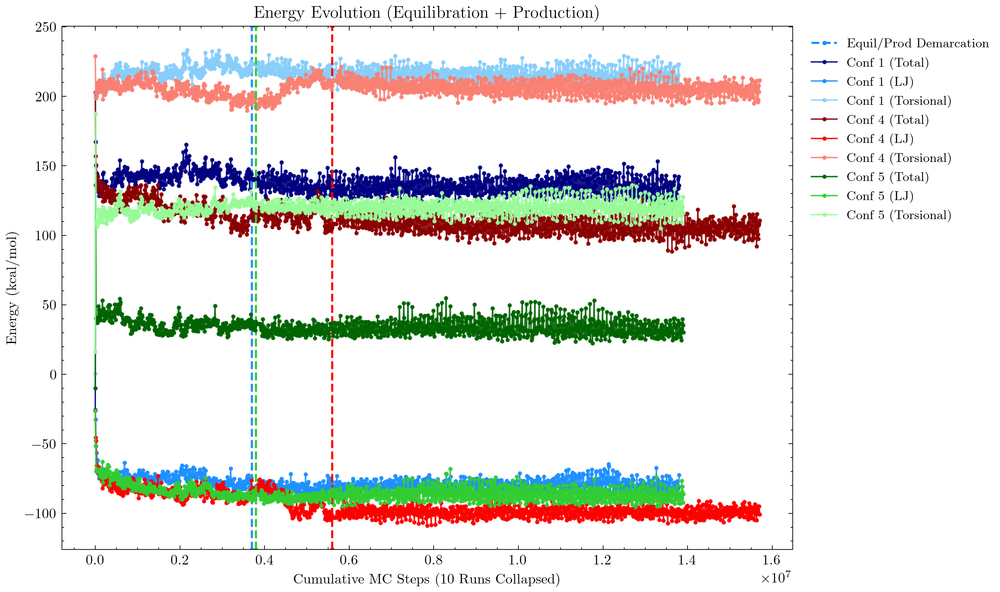
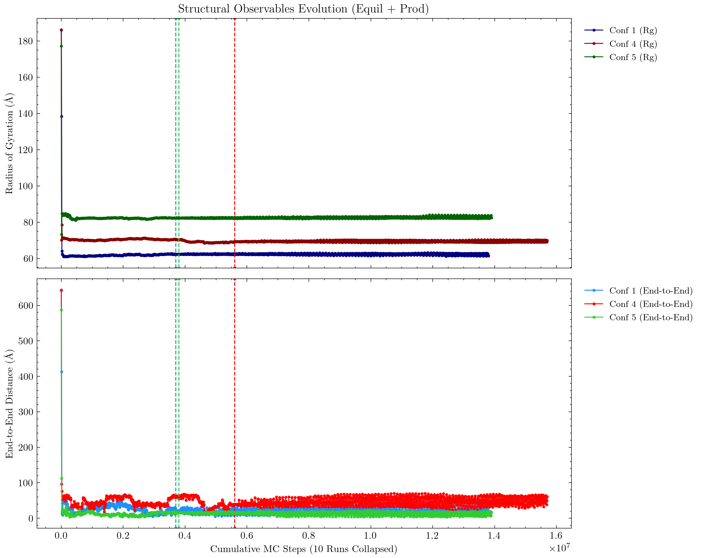
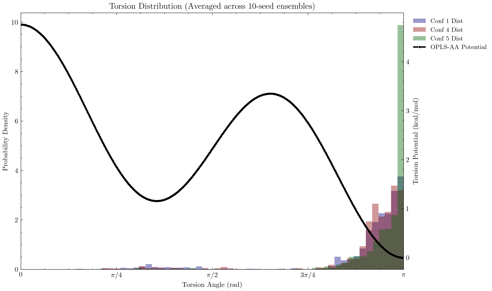

# Contributions

## Project Leader (Github reviews & merges)

As the project leader, I was responsible for reviewing all pull requests, ensuring that the code followed the project guidelines, and merging the code into the main branch. We coordinated through a WhatsApp group chat and would regularly check in on each other's progress. I would also signal to the group when code was merged so we could all pull the latest changes.

Most times, approving and merging was straightforward with no issues, but there was an interesting challenge when multiple uploads from different team members overlapped, causing conflicts. This forced us to learn about stashing and rebasing to the newly updated master branch before recommitting. The following process was ironed out to ensure a smooth integration:

1. Stash local (uncommitted) changes
   ```bash
      git stash
   ```
2. Pull latest changes from master branch
   ```bash
      git checkout master
      git pull main master
   ```
3. Rebase local changes onto master branch so it starts after the new merged code
   ```bash
      git checkout <fork-feature>/<fork-branch>
      git rebase master
   ```
4. Resolve any conflicts & re-apply stashed changes
   ```bash
      git stash pop
   ```
5. Commit and push (using ```--force``` parameter due to rebase)
   ```bash
      git push <fork-remote> <fork-branch> --force
   ```

<br>

## Makefile

As the project evolved, so did the Makefile. Here are some of the features we implemented:

<br>

Starting off, there are few main variables that control the compilation process. 

```makefile
FC       = gfortran
FFLAGS   = -O2 -Wall -Wextra
OBJ_DIR  = ../bin
EXE      = $(OBJ_DIR)/main_serial.x
LIB_OBJ  = $(OBJ_DIR)/parameters.o \
           $(OBJ_DIR)/io.o \
           ...
MAIN_OBJ = $(OBJ_DIR)/main_serial.o

NP          ?= 4
OMP_THREADS ?= 2
```
-  ```FC```: Stands for "Fortran Compiler". We tell it to use gfortran.
-  ```FFLAGS```: These are the compiler flags. ```-O2``` is the optimization schema, and ```-Wall -Wextra``` enables warnings.
-  ```OBJ_DIR``` & ```EXE```: Defines the compiled binaries directory and the name of the final executable.
-  ```LIB_OBJ``` & ```MAIN_OBJ```: Defines the object files for the library and the main program.
-  ```NP``` & ```OMP_THREADS```: Defines the number of processes (MPI) and threads (openMP) to use for the parallel version of the program. The default values are set to 4 and 2, respectively, but they can be overridden by setting them when compiling in the command line (e.g., ```make run_parallel NP=7 OMP_THREADS=3```).

<br>

In order to encompass both the serial and parallel versions of the program, we perform a check on the make command for the word `parallel`. If found, we search the system to ensure the user enviroment has the necessary MPI and OpenMP libraries installed. If not, we print an error message and exit. If they are installed, we overwrite the compiler and add the MPI and OpenMP flags to the `FFLAGS` variable.

```makefile
ifneq (,$(findstring parallel,$(MAKECMDGOALS)))
  # MPI Compiler Wrapper Verification
  MPI_BIN := $(shell command -v mpif90 2>/dev/null)
  ifeq ($(strip $(MPI_BIN)),)
    $(error "MPI Compiler is required but 'mpif90' was not found! Please install it (e.g. 'sudo apt install openmpi-bin')")
  endif
  # Overwrite Compiler for MPI parallelization flag linking
  FC = mpif90
  ...
```

<br>

Instead of writing a rule for every single ```.f90``` file, we use a pattern rule (using ```%```).

```makefile
$(OBJ_DIR)/%.o: lib/%.f90
	@mkdir -p $(OBJ_DIR)
	$(FC) $(FFLAGS) -J$(OBJ_DIR) -I$(OBJ_DIR) -c $< -o $@
```
-  It says: "To make any ```.o``` file in the object directory (```bin/```) from a matching ```.f90``` file in ```lib/```, run this command."
-  ```-c $<```: Compiles the "first dependency" (```$<```, which is the ```.f90``` file) without linking (because that's done in the ```$(EXE)``` target).
-  ```-J$(OBJ_DIR) -I$(OBJ_DIR)```: Tells Fortran to put module ```.mod``` files in the ```bin/``` folder.

<br>

The following is an example of the `all` target (serial version of the program) with its executable structure, which we then follow up with the explicit dependencies to create the ```.o``` files for the library modules and the main program

```makefile
all: $(EXE)

$(EXE): $(LIB_OBJ) $(MAIN_OBJ)
	@mkdir -p $(OBJ_DIR)
	$(FC) $(FFLAGS) -o $@ $(LIB_OBJ) $(MAIN_OBJ)

$(OBJ_DIR)/energy.o: lib/energy.f90 \
                     $(OBJ_DIR)/parameters.o
...

$(OBJ_DIR)/main_serial.o: main_serial.f90 $(LIB_OBJ)
	@mkdir -p $(OBJ_DIR)
	$(FC) $(FFLAGS) -J$(OBJ_DIR) -I$(OBJ_DIR) -c $< -o $@

```
-  ```all```: This is the default target that needs ```$(EXE)``` to exist.
-  ```$(EXE)```: To build the final executable, it needs all the .o files from the ```../bin``` folder, which it makes sure exists (```mkdir -p```), and then links them all together using ```gfortran``` or ```mpif90``` to output (```-o $@```) the final program.
   - **Note**: The ```@``` symbol is used 2 different ways here: 
      1. Before the ```mkdir``` command to suppress being printed to the terminal.
      2. As an automatic variable representing the target name (```$(EXE)``` in this case).


<br>

Last, we declare the shortcut commands as ```.PHONY``` targets to prevent conflicts with files that may have the same name as a target.

```makefile
.PHONY: all clean run figures pipeline

run: all
	@mkdir -p ../results
	$(EXE)

figures:
	python lib/plot_results.py

clean: 
	rm -rf $(OBJ_DIR)/*.o $(OBJ_DIR)/*.mod $(EXE)

pipeline:
	$(MAKE) run
	$(MAKE) figures
```
-  This enables the following compile-time shortcuts:
   - ```make run```: Automatically builds the code (```all```) and then executes it.
   - ```make figures```: Envokes python to generate the plots from the ```../results``` folder.
   - ```make clean```: Acts like a reset button, deleting all compiled files to start fresh.
   - ```make pipeline```: A neat wrapper we built to run the code and generate the python plots back-to-back.

<br>

## Main - Serial

Since the initial code submission, we have updated the serial version of our file `main_serial_equil.f90` to incorporate an equilibration check based on the Geweke equilibration diagnostic (Geweke, J. 1992). Specifically designed for Markov Chain Monte Carlo simulations, this technique allows us to separate the simulation into equilibration and production phases during runtime as opposed to analyzing the results afterwards. It also allows us to identify and save an equilibrated geometry which can then be used to save time by bypassing the initial phase. 

<br>

The simulation begins by reading in the configurations from `input.dat` and building the starting coordinates. If these are not overwritten by a previously saved equilibration .xyz file, the program will initialized and enter **Phase 1: Equilibration**.

```fortran
  do while (.not. is_equilibrated)
    istep = istep + 1

    ! Annealing:
    if (istep <= n_steps) then
      T = T_ini - dT * dble(istep - 1)
    else
      T = T_fin
    end if
    
    ! Monte Carlo Step
    call mc_step(n_carbons, n_atoms, coords, symbols, explicit_h, &
                 beta, max_delta, E_total, E_lj, E_tors, accepted_step)
    
    if (accepted_step) total_accepted = total_accepted + 1

    ! Output periodically
    if (mod(istep, print_interval) == 0 .or. istep == 1) then
      ! Energies
      write(u_ener, '(I10, 3F15.4)') istep, E_total, E_lj, E_tors

      ! Observables
      rg2 = compute_rg(n_carbons, coords)
      ree2 = compute_end_to_end(n_carbons, coords)
      write(u_obs, '(I10, 2F15.4)') istep, sqrt(rg2), sqrt(ree2)
      ...
```
- `do while (.not. is_equilibrated)`: Replaces traditional hard-coded burn-in periods with a dynamic loop that stays alive until equilibration is met.
- `T = T_ini - dT * dble(istep - 1)`: We had originally discussed introducing simulated annealing to help the simulation escape local minima, however the project instructions say to assume a fixed temperature. This portion of the code was left in case we wanted to set T_ini & T_fin to different values. 
- `call mc_step(...)`: Subroutine to perform a single Monte Carlo step.
- We control when to compute & store the observables (energy, torsion, trajectory, etc) based on the `print_interval` variable.

<br>

# --------- MANEL REVIEW NEEDED ---------

As stated above we use the Geweke equilibration diagnostic for a dynamic determination of reaching equilibrium. To prevent false positives due to auto-correlation between adjacent MC steps, we evaluate the system periodically:

```fortran
    ! --- Geweke Check ---
    if (mod(istep, geweke_sample_interval) == 0) then
      
      gbuf_count = gbuf_count + 1
      if (gbuf_count <= n_geweke) then
        gbuf_E(gbuf_count) = E_total
        gbuf_Rg(gbuf_count) = rg2
      else
        ! ... (shift buffer and add new state) ...
      end if
      
      if (gbuf_count >= n_geweke .and. mod(gbuf_count, eval_freq) == 0) then
        ! ... (calculate standard errors and Z-scores) ...
        if (z_E < z_crit) then
            ! ... 
            is_equilibrated = .true.
      ...
```
- `mod(istep, geweke_sample_interval) == 0`: Enforces periodic sampling (e.g., every 10,000 steps) so the data points entering the convergence test are truly statistically independent.
- `gbuf_E` & `gbuf_Rg`: Sliding window arrays of size `n_geweke` (300) that hold the recent energy and Radius of Gyration states respectively.
- `z_E < z_crit`: Evaluates the $Z$-score comparing the means of the first 10% and last 50% of the buffer. If it falls below the critical threshold ($1.96$), the system is flagged as structurally stable (`is_equilibrated = .true.`).

<br>

Once equilibrium is reached, all Phase 1 files are closed and the program transitions seamlessly into **Phase 2: Production**, resetting the clock and creating new tracking files.

```fortran
  ! ======================================================
  ! PHASE 2: PRODUCTION
  ! ======================================================
  
  call cpu_time(cpu_start)
  do istep = 1, n_steps

    call mc_step(n_carbons, n_atoms, coords, symbols, explicit_h, &
                 beta, max_delta, E_total, E_lj, E_tors, accepted_step)
  ...
```
- `call cpu_time(cpu_start)`: We separate the 2 phases' timers to assist in benchmarking as there is the ability to preload an equilibrated geometry and go straight into production. 
- `n_steps`: Benchmarking the benefits of parallelization is also helped by ensuring production runs have the same number of MCS performed. This can be controlled from the `input.dat` file settings. 

<br>

## Visualization

The visualization of our results is handled by ```plot_results.py```. It starts by reading the ```input.dat``` file to determine whether the simulation was run using explicit hydrogens so it knows which theoretical potential to compare against.

<br>

# --------- Itxaso Review Needed -------------

Before plotting the torsion angles, the script conducts a statistical analysis to detect when the Monte Carlo simulation reaches thermodynamic equilibrium, so it can discard the burn-in period.

```python
def detect_equilibration(x):
    # Chodera (2016) method to find optimal equilibration index (t0)
    n = len(x)
    best_neff = 0.0
    best_t0 = 0
    
    candidates = np.unique(np.linspace(0, int(n * 0.9), min(200, n)).astype(int))
    for t0 in candidates:
        sub = x[t0:]
        _, g = integrated_autocorr_time(sub)
        neff = (n - t0) / g
        if neff > best_neff:
            best_neff, best_t0 = neff, t0
            
    return best_t0
```

- ```integrated_autocorr_time(sub)```: Calculates the statistical inefficiency ($g$) and the integrated autocorrelation time ($\tau_{int}$) of the dataset using Fast Fourier Transforms (FFT).
- ```neff = (n - t0) / g```: Estimates the number of effectively uncorrelated samples.
- ```best_t0```: The algorithm sweeps through candidate discard points and selects the index t0 that maximizes the effective sample size, marking the end of the equilibration phase.

# ------------------------------------------------

Then, there are 3 defined functions for each of the plots using matplotlib:
* ```plot_energies```: Plots the total energy, LJ energy, and torsion energy against the MC steps.
* ```plot_observables```: Plots the radius of gyration and end-to-end distance against the MC steps.
* ```plot_torsions```: Plots the torsion angles against the MC steps and compares them to the theoretical potential.

Finally, the script moves on to generating the actual .pdf plots using matplotlib. The most complex of these is the torsion distribution plot, which overlays our histogram data against the theoretical TraPPE potentials.

```python
def plot_torsions(tors_file, energy_file, explicit_h=True):
    if not explicit_h:
        c1, c2, c3 = 0.705, -0.135, 1.572
    else:
        c1, c2, c3 = 0.8700, -0.0785, 1.5075
    def torsion_potential(phi):
        return (c1 * (1.0 + np.cos(phi))
              + c2 * (1.0 - np.cos(2.0 * phi))
              + c3 * (1.0 + np.cos(3.0 * phi)))
```

- ```explicit_h```: The boolean passed from our parser function.
- ```c1, c2, c3```: The TraPPE-UA United Atom coefficients, or the OPLS-AA Effective Backbone coefficients, loaded depending on the simulation type.
- ```torsion_potential(phi)```: Returns the theoretical energy (in kcal/mol) for any given dihedral angle ($\phi$) using trigonometric identities, which is then overlaid on the secondary Y-axis spanning across the histograms.

## Parallelization - Ensemble Averaging

Moving to an Orchestrator-Worker (Star) topology helped with the transition of the serial environment to a dynamically balanced parallel framework with OpenMPI. It achieves maximum CPU utilization by ensuring free workers are constantly assigned tasks until the simulation is complete.

<br>

Although this architechure adds overhead by requiring a single core to abstain from participating in the simulation's calculations, the orchestrator node performs the administrative tasks such as the initial file reading as well as organizing and distributing the workload. This relies upon tags being sent between the nodes to coordinate the simulation.

```fortran
  ! MPI Tags
  integer, parameter :: TAG_REQUEST_WORK = 1
  integer, parameter :: TAG_DO_EQUIL     = 2
  integer, parameter :: TAG_DO_PROD      = 3
  integer, parameter :: TAG_WAIT         = 4
  integer, parameter :: TAG_DIE          = 5
  integer, parameter :: TAG_EQUIL_DONE   = 6
  integer, parameter :: TAG_PROD_DONE    = 7
```


First, the simulation is cleanly segregated into phases where the **Orchestrator Node** acts as a central dispatcher:

```fortran
      do while (completed_prods < size(prod_queue))
         ! Wait for any worker to finish its task and ask for more
         call MPI_Recv(msg, 1, MPI_INTEGER, MPI_ANY_SOURCE, MPI_ANY_TAG, MPI_COMM_WORLD, status, ierr)
         sender = status(MPI_SOURCE)
         tag_recvd = status(MPI_TAG)
```
- `MPI_Recv`: The orchestrator lies in wait for any incoming communication from the worker nodes. 
- `MPI_ANY_SOURCE`: Instead of statically assigning jobs to specific processors up-front, the orchestrator listens to the *entire pool* of available cores. As soon as a worker node finishes its current 1-million-step job, it pings the orchestrator, which instantly deploys the next job from the queue directly to that specific idle worker, ensuring optimal resource utilization. 
- **Staged Execution**: By cleanly separating the logic phases, the orchestrator refuses to load the 10 production jobs into the queue until the prerequisite equilibration run officially finishes. The moment equilibration is met, jobs pop into the queue and cores are reused instantly, guaranteeing no resources are ever permanently "blocked" waiting in idle lines.

<br>

Once a worker has sent an incoming communication signal back to the orchestrator, the orchestrator checks the tag and executes the appropriate logic:

```fortran
         if (tag_recvd == TAG_EQUIL_DONE) then
           ! ... (Orchestrator caches the equilibrated .xyz coordinates and unlocks the production queue)
         else if (tag_recvd == TAG_PROD_DONE) then 
           ! ... (Orchestrator tallies the completed production run)
         end if

         ! If jobs remain in the queue, immediately deploy the next one to the 'sender'
         if (jobs_assigned < size(prod_queue)) then
            call MPI_Send(TAG_DO_PROD, 1, MPI_INTEGER, sender, TAG_DO_PROD, MPI_COMM_WORLD, ierr)
```
- `MPI_Send`: Deploys the next instruction array sequentially to whichever Worker ID is populated in the `sender` variable.
- `TAG_DO_PROD`: An arbitrarily assigned integer tag that tells the receiving Worker process exactly which computational sub-routine to pivot into. 

<br>

The benefits of this star topology combined with phased execution of equilibration runs followed by production runs is compared below to the serial version of the program. As the number of dynamic active nodes increases, the time to complete 10-million MC Steps decreases, albeit non-ideally:


_Fig. x: Comparing timing & efficiency of Ensemble Averaging with various core count to Serial production run_

<br>

Simply adding more cores does not result in a perfectly linear speedup. This can be attributed to parallelization overhead plus device hardware bottlenecks. The most efficient use of cores is found in factors of 10 (2 & 5 cores), in which cases all worker nodes are participating in the final group of remaining 1M MCS steps. The non-factors of 10 could see performance improvements with the addition of a dynamic algorithm that determines how many steps are left once there are fewer 1M MCS jobs remaining than cores participating. This would eliminates worker "dead-time" towards the end of the production run.

<br>

## Parallel Simulation Results


_Fig. x: Total, LJ, & Torsional Energy plots across various initial conformations_

This plot tracks the total, Lennard-Jones (LJ), and torsional energy trends over the progression of Monte Carlo Steps (MCS) for configurations 1, 4, and 5. The vertical dashed lines mark the transition point between equilibration and the subsequent 10-million step production data. 

In this particular instance of the combined simulation, the torsional and LJ energy took longer to stabilize in configuration 4 than the other configurations (1 & 5), meaning equilibration took longer to pass the Geweke equilibration determination test as indicated in the red, vertical, dashed line. For this reason its combined simultion to run for $\sim1.55x10^7$ total steps.

An important observation and detail obtained from this graph is how initial configuration influences the total energy within the simulation. Configurations 1 & 4 are rigid and straight helical structures, respectively, while introducing random, out-of-plane tilts to configuration 5 allowed it to find a much lower equilibrated torsional (and therefore, total) energy.


<br> 


_Fig. x: Radius of Gyration & End-to-End Distance plots across various initial conformations_

This chart displays the Radius of Gyration (Rg) and End-to-End Distance for the different configurations. As with the energy plots above which showed similar torsional energies between Conf 1 & 4 while Conf 5 was much lower after equilibration, the Rg for Conf 5 is the most distinct here as well. Configuration 5, due to its initial out-of-plane tilts, was able to better relax its bonds into low-energy rotational valleys, allowing the chain to naturally untangle and adopt an expanded, looser geometry, mathematically resulting in a higher Radius of Gyration.


<br> 


_Fig. x: Torsional distribution of post-equilibrated MCS across various initial conformations_

The low-energy rotational valley relaxation tendency for Conf 5 is even more apparent in this graph, which shows the probability density of the each polymer exploring various dihedral (torsion) angles. Each configuration's post-equilibration data is compared to the OPLS-AA potential, where the results confirm the highest probability at $\pi$ (trans) configuration. While all configurations follow the expected potential, Conf 5 adheres most closely, fully affirming the above energy and observable data. Also of note is how the graph demonstrates the expected rise in probablity around the potential's local minima at $\sim \pi/3$.

<br>
<br>
<br>
<br>
<br>
<br>
<br>

## UNUSED WRITING

**Project Impact**: While raw energy can sometimes settle rapidly, physical tangles and extensions inside long macroscopic polymers often require extended periods to fully untangle. The eventual flattening of Rg and End-to-End values verifies that the polymer has achieved a true spatial equilibrium. Furthermore, the steady stability throughout the interleaved 10-million-step stretches proves that our technique of batching multiple independent random-seeded 1-million-step parallel runs generates completely robust, reliable macroscopic samples capable of replacing a single sequential run.

**Graph Analysis**: This distribution visualizes the probability density of the polymer exploring various dihedral (torsion) angles, constructed exclusively by aggregating the pure post-equilibration production data from the parallel worker nodes. It is superimposed over the theoretical mathematical potential (dashed black line).

**Project Impact**: The histogram peaks for all three independent polymer configurations perfectly align within the low-energy target "valleys" of the theoretical potential curve. This represents the ultimate verification of our parallel approach. It definitively proves that the Master-Worker topology's localized Metropolis acceptance criteria functioned flawlessly across distributed nodes, accurately guiding the simulated chains into realistic physical states. By successfully distributing the load, we achieve massive speedups while retaining the absolute energetic fidelity required for complex structural modeling.